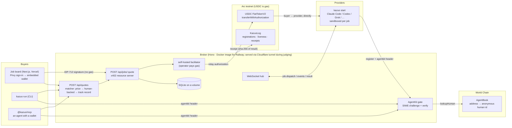

# Architecture

How Kazuo is put together, and why the awkward parts are the way they are.

---

## The shape

```
  buyer                        broker                       provider node
  (app / CLI / MCP)         (this repo)                   (kazuo CLI, anywhere)
        │                         │                                │
        │  1. POST /api/quotes    │                                │
        ├────────────────────────►│  match on price × liveness     │
        │  ◄── quote (pinned)     │                                │
        │                         │                                │
        │  2. POST /api/jobs/:q   │                                │
        ├────────────────────────►│                                │
        │  ◄── 402 + accepts[]    │  payTo = the PROVIDER          │
        │                         │                                │
        │  3. X-PAYMENT ─────────►│  facilitator relays it         │
        │     (EIP-3009 auth,     │  and pays the fee ───────────► Arc
        │      NOT a transaction) │  ~1s to finality               │
        │  ◄── 200 + jobId        │                                │
        │                         │                                │
        │                         ├─── job.dispatch (WebSocket) ──►│
        │  ◄═══ SSE events ═══════╪◄══ tool calls, edits ══════════┤
        │  ◄── result             │◄── answer ─────────────────────┤
        │                         ├─── receipt ──────────────────► KazuoLog
```

Four processes, three of which are optional. The broker is the only thing that
has to be running for the network to exist.

### Architecture diagram



---

## Packages

| Package | What it is |
|---|---|
| `packages/protocol` | The shared vocabulary: domain types, money math, Arc plumbing, x402 wiring. Depended on by everything. No I/O beyond an RPC endpoint. |
| `packages/cli` | `kazuo` — the provider node, and the buyer-side `kazuo run`. Publish-ready (`@kazuo/cli`), not on npm yet. |
| `packages/mcp` | `@kazuo/mcp` — Kazuo as an MCP server, so an agent can buy capacity. |
| `services/broker` | Registry, matcher, x402 resource server, self-hosted facilitator, KazuoLog audit writer, SQLite. |
| `apps/app` | The job board. |
| `apps/landing` | Marketing. |

---

## Decisions worth explaining

### The broker is never the payee

The 402 response names the **matched provider's own Arc address** as `payTo`.
Money moves buyer → provider in a single transfer; the broker's key never
touches it. That is why `PaymentOption.payTo` is a resolver rather than a
constant, and why a quote is a first-class object — see below.

The protocol fee is 0%. If it ever isn't, it would have to become a second
transfer or a splitter contract — an EIP-3009 authorization moves value between
exactly two parties, which is a real constraint Hedera's native multi-party
transfer did not have.

### A quote is a price commitment

x402 asks the server for payment requirements **twice** — once to answer 402,
once to check the payment that comes back. Both answers must name the same
provider at the same amount.

If the matcher ran twice, a buyer could be quoted one node and pay another. If
anything else differed between the two calls, the payload would no longer match
the requirements and a correctly-signed payment would be rejected with a bare
402.

So `POST /api/quotes` freezes provider, price, `usdcAmount` **and the token's
EIP-712 domain**, and both resolvers read from that. The domain matters more
than it looks: the buyer signs an EIP-3009 authorization against
`(name, version, chainId, verifyingContract)`, and x402's EVM scheme fills the
first two in automatically only for networks in its built-in stablecoin
registry — which Arc is not in. Omit it and the buyer signs against a domain of
its own guessing, producing a signature that verifies against nothing.

Quotes are single-use and expire in 5 minutes.

### Payment settles before the job runs

An EIP-3009 authorization carries `validAfter` / `validBefore`, and x402
advertises a 300-second window. A five-minute coding job would outlive its own
payment, and the provider would be unpaid for work already done.

So Kazuo settles up front. The other risk — a provider that takes the money and
fails — is covered at the network level rather than per-transaction: a failed
job is **reassigned to another provider at no extra charge**, and the failure
counts against the original provider's success rate, which is what the matcher
sorts on.

### Provider nodes dial out

The node opens a WebSocket **to** the broker; the broker never calls in.
Someone sharing a laptop is behind NAT, on hotel wifi, on a machine that sleeps.
Outbound works from all of those with no port forwarding and no inbound attack
surface on their machine.

A Cloudflare tunnel is supported and useful — it gives the node a public status
page anyone can health-check, and the broker a second delivery path — but
earnings never depend on it.

### Liveness is not a database row

The registry is in memory on purpose: a provider is only real while heartbeats
keep arriving. Membership has nothing worth surviving a restart.

What *does* survive goes to SQLite (jobs, payments, lifetime earnings) and to
the `KazuoLog` contract (registrations, sampled heartbeats, receipts). The second
one is the point: you do not have to trust the broker's database, because the
record is public and append-only, readable from any RPC without credentials.

Unlike a Hedera topic message, every entry costs gas — measured at $0.00088 —
so what gets written is a budget decision. Heartbeats are sampled to one per
provider per hour; at the five-minute cadence inherited from Hedera an idle
provider would cost the broker $0.25/day against a 0% fee.

Note `registry.get()` re-derives status on every call. Status is a function of
the clock, and the guard that decides whether a quoted provider is still alive
enough to be paid reads it.

### What the chain no longer forces on us

Two entries used to live here, and both are gone rather than fixed:

1. A Hedera `Client` **could not be shared** between payment settlement and
   `TopicMessageSubmitTransaction` — the topic write is chunked and re-freezes
   itself inside `executeAll`, so a concurrent execute on the same client failed
   with *"transaction must have been frozen"*.
2. A `Client` **could not be reused across settlements at all**. The payload was
   a transaction frozen by the *payer's* client, and submitting one mutated the
   submitting client's state; the next settlement died inside the SDK. The
   symptom was brutal — the first payment of a process succeeded and every one
   after returned a bare 402.

viem clients hold no per-transaction state, so the broker runs one wallet client
for both jobs and neither failure has a counterpart here.

### Reading the log back

`eth_getLogs` on Arc's public RPC is capped at roughly 10,000 blocks; an
unbounded `fromBlock: 0` is rejected outright as an invalid parameter. That
matters more than it sounds, because the obvious implementation — scan from the
deployment block — does not run *slowly*, it **errors**, and the natural place to
catch that error renders the audit trail as empty. An empty audit log looks like
a working feature with nothing in it yet.

The first reader walked backwards from the head in 9,000-block windows. It could
not reach receipts more than about two days old — the contract is six million
blocks back — and a page load plus a landing page polling it rate-limited the
public RPC into 502s. So the broker now keeps a **forward index**
(`services/broker/src/log-index.ts`) in SQLite: it seeds from receipt
transactions it published itself, scans forward from `KAZUO_LOG_FROM_BLOCK` one
window at a time with a persisted cursor (a restart resumes, it does not start
over), follows the head once caught up, and serves `/api/receipts` and
`/api/log/:kind` from the index. It makes **no RPC call while the broker is
writing** — a settlement or an audit entry — because Arc's public endpoint has one
small rate budget and a backfill that spent all of it once made registration and
heartbeat writes fail. RPC clients retry "limit exceeded" with a 1 s doubling
backoff for the same reason.

### Bundlers

`@x402/*` must be in Next.js `serverExternalPackages`. Bundled, they load fine
and then sign *subtly wrong*, and every payment comes back 402 with nothing in
the logs.

---

## Data flow, precisely

**Registration.** Node → `POST /api/providers/register` → registry keyed on
`nodeId` (stable across restarts, so earnings aren't reset) → bearer token
back → an on-chain registration entry. Node opens `wss://…/ws/provider?token=…`.

**Heartbeat.** Every 15s. Offline after 45s (three missed beats), reaped after
10 minutes. One beat per provider per hour is appended to KazuoLog — every entry costs gas
($0.00088), and every beat would cost an idle provider $0.25/day against a 0% fee.

**Quote.** Matcher walks live providers × capabilities, filters on adapter and
price ceiling and availability and free concurrency, sorts by price, then
success rate, then load.

**Payment.** `@x402/hono` middleware wraps `POST /api/jobs/:quoteId`. Verify and
settle go to the facilitator, which is in-process by default
(`KAZUO_FACILITATOR=self`) or a hosted URL.

**Dispatch.** `job.dispatch` down the socket. Provider runs the adapter in a
fresh directory under `~/.kazuo/jobs/`, streams `job.event`, returns
`job.result`. HTTP fallbacks exist for both, because the work is already paid
for and a dropped socket must not be why a buyer never gets an answer.

**Receipt.** Published once the job is terminal **and** payment is recorded —
a fast job routinely finishes before settlement lands, and a receipt with an
empty transaction id proves nothing. Carries a SHA-256 of the result, so the
payload stays private while the record stays verifiable.

---

## Testing

347 tests (protocol 55 · broker 129 · cli 130 · mcp 8 · app 25), none of which need credentials or a network.

- **Unit** — money math against hand-computed integers, key parsing,
  the two views of one USDC balance, the matcher's ordering rules, the job state
  machine, ANSI-safe terminal layout.
- **Integration** (`services/broker/test/integration.test.ts`) — a real HTTP
  server, the real Hono app, the real x402 resource server, the real WebSocket
  hub, and a fake provider that behaves like the CLI. Only the facilitator and
  the audit writer are stubbed. Covers the full lifecycle, replay refusal,
  reassignment on failure, SSE, and cross-provider auth.

The gap worth naming: the tests run under vitest, which provides `require` in
module scope. Production is ESM, where it isn't — which is how the broker once
ran happily in memory while `store.test.ts` passed. Persistence now uses
`createRequire`, and the fallback logs loudly rather than silently.
